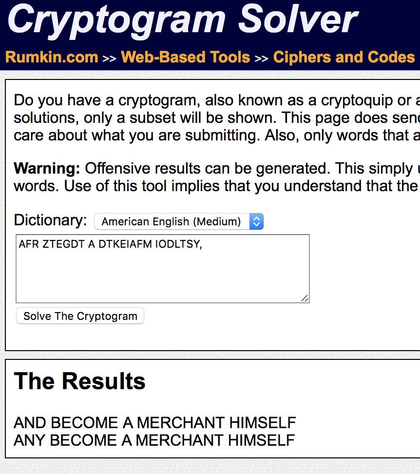
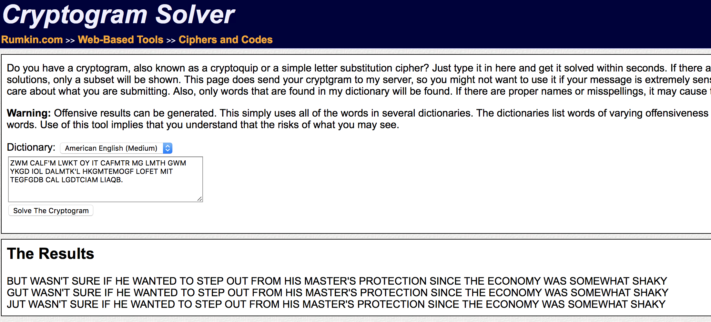
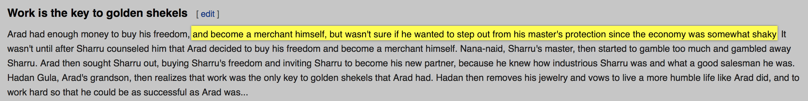

# HackDefCTF Quals-2018 - Cipheryon (100 pts)

> **Descripción:** *Puedes identificar el criptograma utilizado?*

El archivo [ciphertext](./ciphertext) que se proporciona muestra una serie de palabras intelegibles separadas por puntos y comas. Al separar el texto con saltos de línea podemos verlo de una mejor forma.

~~~
AKAR IAR TFGWUI DGFTB MG ZWB IOL YKTTRGD, 
AFR ZTEGDT A DTKEIAFM IODLTSY, 
ZWM CALF'M LWKT OY IT CAFMTR MG LMTH GWM YKGD IOL DALMTK'L HKGMTEMOGF LOFET MIT TEGFGDB CAL LGDTCIAM LIAQB. 
OM CALF'M WFMOS AYMTK LIAKKW EGWFLTSTR IOD MIAM AKAR RTEORTR MG ZWB IOL YKTTRGD AFR ZTEGDT A DTKEIAFM IODLTSY. 
FAFA-FAOR, LIAKKW'L DALMTK, MITF LMAKMTR MG UADZST MGG DWEI AFR UADZSTR ACAB LIAKKW. 
AKAR MITF LGWUIM LIAKKW GWM,
ZWBOFU LIAKKW'L YKTTRGD AFR OFXOMOFU LIAKKW MG ZTEGDT IOL FTC HAKMFTK, 
ZTEAWLT IT QFTC IGC OFRWLMKOGWL LIAKKW CAL AFR CIAM A UGGR LASTLDAF IT CAL.
IARAF UWSA,
AKAR'L UKAFRLGF, 
MITF KTASONTL MIAM CGKQ CAL MIT GFSB QTB MG UGSRTF LITQTSL MIAM AKAR IAR.
IARAF MITF KTDGXTL IOL PTCTSKB AFR XGCL MG SOXT A DGKT IWDZST SOYT SOQT AKAR ROR, 
AFR MG CGKQ IAKR LG MIAM IT EGWSR ZT AL LWEETLLYWS AL AKAR CAL...YSAUOLAKARAKAKRK
~~~

Después de algunos minutos de búsqueda se encontró la herramienta [Cryptogram Solver](http://rumkin.com/tools/cipher/cryptogram-solver.php) en la que se puede colocar el criptograma y el lenguaje del diccionario que se utilizará para la solución del mismo. Al ingresar algunas de las cadenas del criptograma, la herramienta muestra las posibles soluciones.

  

  

Una vez obtenidas esas cadenas en *texto claro*, se buscó en internet alguna pista sobre el texto detras del criptograma y se encontró el siguiente [extracto](https://en.wikipedia.org/wiki/The_Richest_Man_in_Babylon_(book)#Work_is_the_key_to_golden_shekels)

  

Al hacer el mapeo con el texto proporcionado para el reto, se pudo observar que era casi lo mísmo excepto por `YSAUOLAKARAKAKRK` ...

~~~
AKAR IAR TFGWUI DGFTB MG ZWB IOL YKTTRGD,
Arad had enough money to buy his freedom, 
AFR ZTEGDT A DTKEIAFM IODLTSY,
and become a merchant himself, 
ZWM CALF'M LWKT OY IT CAFMTR MG LMTH GWM YKGD IOL DALMTK'L HKGMTEMOGF LOFET MIT TEGFGDB CAL LGDTCIAM LIAQB.
but wasn't sure if he wanted to step out from his master's protection since the economy was somewhat shaky.  
OM CALF'M WFMOS AYMTK LIAKKW EGWFLTSTR IOD MIAM AKAR RTEORTR MG ZWB IOL YKTTRGD AFR ZTEGDT A DTKEIAFM IODLTSY. 
It wasn't until after Sharru counseled him that Arad decided to buy his freedom and become a merchant himself.
FAFA-FAOR, LIAKKW'L DALMTK, MITF LMAKMTR MG UADZST MGG DWEI AFR UADZSTR ACAB LIAKKW. 
Nana-naid, Sharru's master, then started to gamble too much and gambled away Sharru. 
AKAR MITF LGWUIM LIAKKW GWM,
Arad then sought Sharru out,
ZWBOFU LIAKKW'L YKTTRGD AFR OFXOMOFU LIAKKW MG ZTEGDT IOL FTC HAKMFTK, 
buying Sharru's freedom and inviting Sharru to become his new partner,
ZTEAWLT IT QFTC IGC OFRWLMKOGWL LIAKKW CAL AFR CIAM A UGGR LASTLDAF IT CAL.
because he knew how industrious Sharru was and what a good salesman he was. 
IARAF UWSA,
Hadan Gula,
AKAR'L UKAFRLGF, 
Arad's grandson,
MITF KTASONTL MIAM CGKQ CAL MIT GFSB QTB MG UGSRTF LITQTSL MIAM AKAR IAR.
then realizes that work was the only key to golden shekels that Arad had.
IARAF MITF KTDGXTL IOL PTCTSKB AFR XGCL MG SOXT A DGKT IWDZST SOYT SOQT AKAR ROR, 
Hadan then removes his jewelry and vows to live a more humble life like Arad did,
AFR MG CGKQ IAKR LG MIAM IT EGWSR ZT AL LWEETLLYWS AL AKAR CAL...YSAUOLAKARAKAKRK
and to work hard so that he could be as successful as Arad was...
~~~

Finalmente, conociendo el mapeo de letras que se utilizó para el criptograma, se sustituyó la palabra restante `YSAUOLAKARAKAKRK` = `flagisaradarardr` y se encuentra la flag **`flag{aradarardr}`**.
