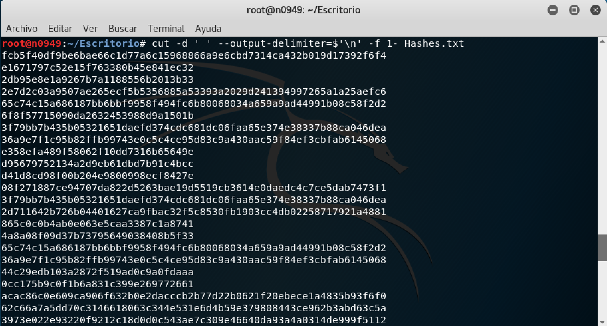
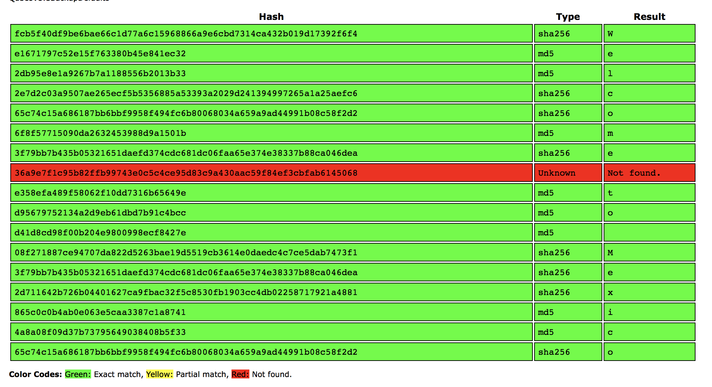
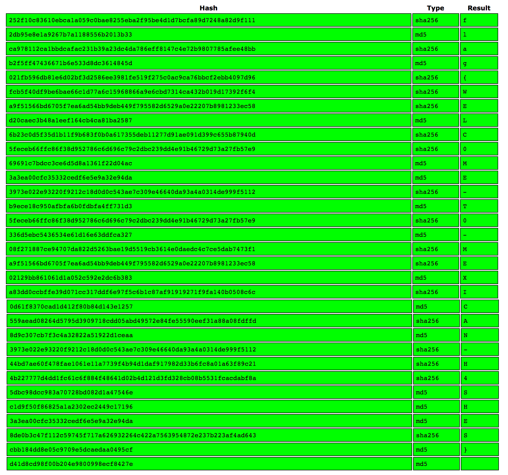

# HackDefCTF Quals-2018 - Hashes (100 pts)

El reto proporciona el archivo [Hashes.txt](./Hashes.txt) en el cual se observan lo que parecen ser hashes de tipo`md5` y `sha-256` separados por espacios. 

Lo primero que podemos hacer es sustituir los espacios por saltos de línea con ayuda del comando `cut -d ' ' --output-delimiter=$'\n' -f 1- Hashes.txt` y redireccionando la salida a un nuevo txt o bien copiando el contenido en un word, excel, etc.

  

Posteriormente utilizaremos [CrackStation](https://crackstation.net) para poder crakear los hashes. Comenzamos introduciendo algunos de ellos. Podemos observar que cada uno de estos representa una letra y de acuerdo a la frase que se muestra se intuye que vamos por el camino correcto y que la flag esta cerca...

  

Unos hashes más adelante aparece la flag: **`flag{WELC0ME-T0-MEXICAN-H4SHES}`** 

  

