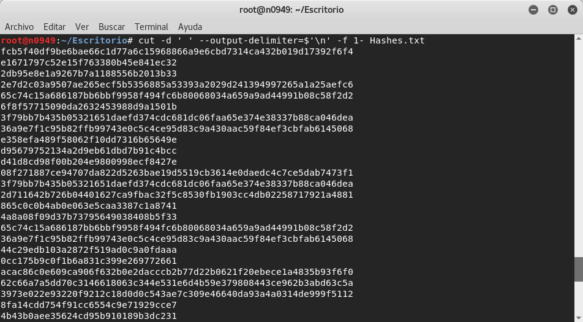
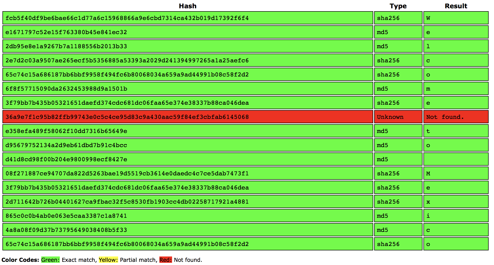

# HackDefCTF Quals-2018 - Hashes (100 pts)

> **Descripción:** *Puedes crackear los hashes y encontrar la bandera? Tranquilo, no debe tomar mucho tiempo crackearlos, te lo aseguramos.*

El reto proporciona el archivo [Hashes.txt](./Hashes.txt) en el cual se observan lo que parecen ser hashes de tipo`md5` y `sha-256` separados por espacios. 

Lo primero que realizamos fué sustituir los espacios por saltos de línea con ayuda del comando `cut -d ' ' --output-delimiter=$'\n' -f 1- Hashes.txt` para facilitar la lectura y el copiado de los hashes.

  

Posteriormente se utilizó [CrackStation](https://crackstation.net) para poder crakear los hashes. En los primeros resultados se observó que cada uno de ellos representaba una letra y de acuerdo a la frase que se puede leer, se intuye que vamos por el camino correcto y que la flag esta cerca...

  

Unos hashes más adelante aparece la bandera: **`flag{WELC0ME-T0-MEXICAN-H4SHES}`** 

  

