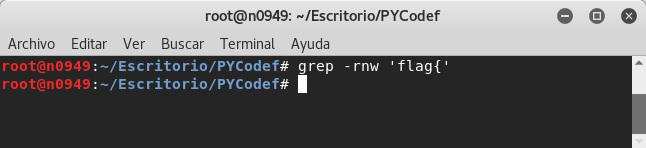
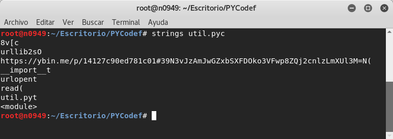
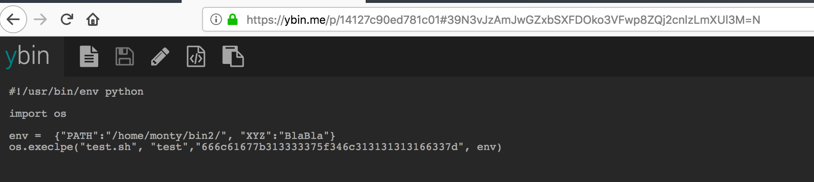

# HackDefCTF Quals-2018 - PyCode (100 pts)

> **Descripción:** *A veces los paquetes tienen banderas escondidas, puedes encontrarla?*

> **Hint:** *Revisen cada archivo de python dentro del zip!!*

* [PyCode](./PYCode)

Al descomprimir el archivo, observamos un proyecto completo con archivos de tipo `json`, `python`, `cfg`, `javascript` entre otros. De acuerdo a la pista que se da, la búsqueda de la bandera solo se acota a los archivos `py` o `pyc`.

Sabemos que el formato de la bandera es *`flag{algo_interesante_escrito_aqui}`*, entonces podemos ejecutar el comando `grep -rnw 'flag' {`

  

Al no obtener salida alguna, concluimos que la bandera no se encuentra escrita en texto claro, sino que debe estar codificada, o debe haber alguna pista en el código que nos mande la bandera o nos lleve a ella. Después de revisar manualmente los archivos python, en `util.pyc` encontramos el link: `https://ybin.me/p/14127c90ed781c01#39N3vJzAmJwGZxbSXFDOko3VFwp8ZQj2cnlzLmXUl3M=N(`

  

El link redirige a un sitio donde vemos otro pequeño script de python..

  

Después de un tiempo de pensar cómo rayos obtener la bandera 😂, dedujimos que no debía ser tan dificil por la cantidad de puntos del reto. Observando detenidamente el script que se proporcionaba en el link, nos dimos cuenta de una cadena en hexadecimal: `666c61677b313333375f346c313131313166337d`... y después de convertirlo en ascii se obtiene la bandera **`flag{1337_4l11111f3}`**

  

