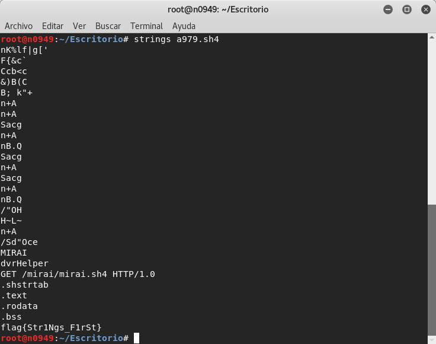

# HackDefCTF Quals-2018 - Rene (50 pts)

> **Descripción:** *Cuál es el paso básico inicial en el análisis de malware*

> *El archivo adjunto y por ende esta protegido con el password -> infected. Ábrelo en una VM o el Anti-Virus lo bloqueará*

* [**a979.zip**](./a979.zip)

Una vez descomprimido el archivo, utilizando la herramienta `strings` se obtiene la bandera: **`flag{Str1Ngs_F1rSt}`**

  

