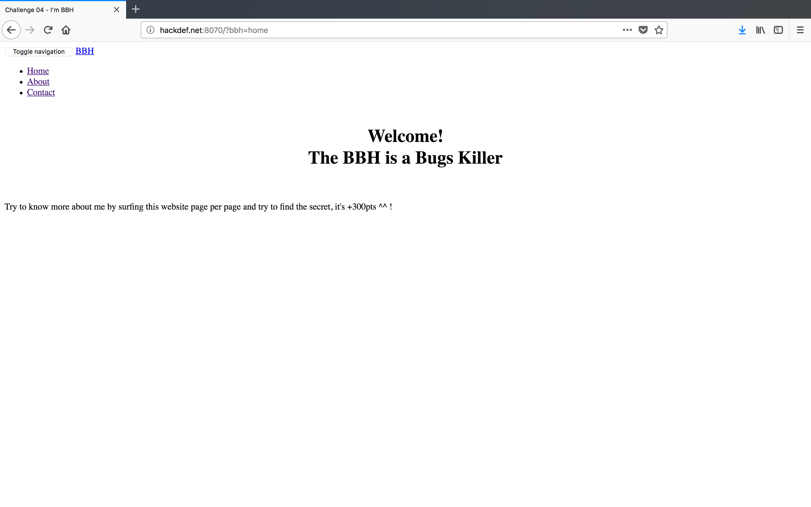
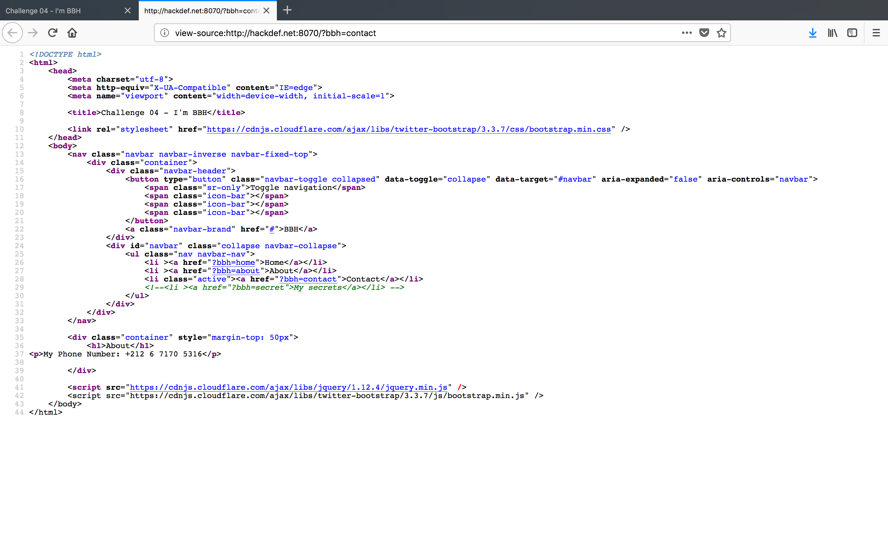
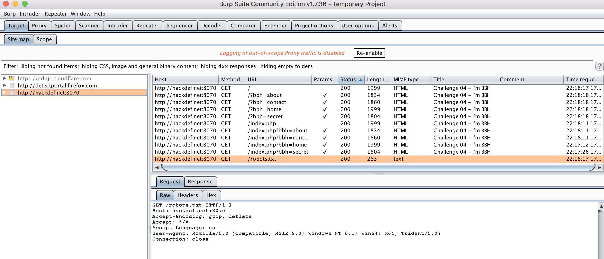
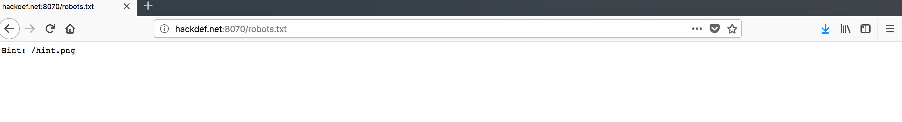
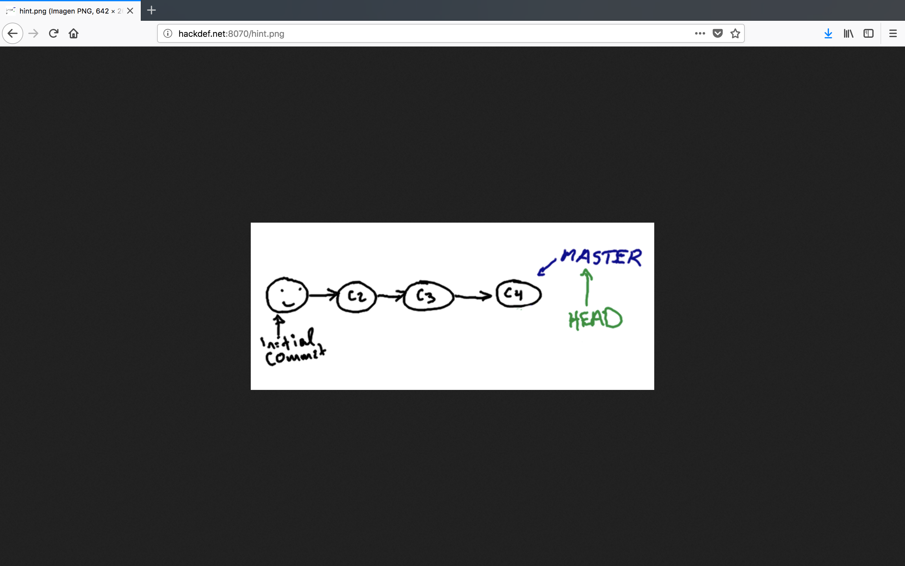

# HackDefCTF Quals-2018 - BBH (300 pts)

> **Descripción:** *The BBH is a Bugs Killer *

* http://www.hackdef.net:8070/

Al ingresar al sitio, se observan 3 links a `home`, `about` y `contact` los cuales muestran contenido diferente, pero nada de utilidad que nos lleve a la bandera..

  

Revisando el código fuente, observamos que hay un comentario de un `href` hacia `secret`, sin embargo si tratamos de ingresar modificando la url pero nos redirigia al home del sitio. 

  

Una vez inspeccionado el sitio manualmente , por medio de burp lanzamos un *spider* para ver si podía localizar `secret`, sin embargo nos encontramos con algo de bastante utilidad...`robots.txt`

  

Al ingresar a este archivo nos mostraba un recurso... `/hint.png`

  

La pista era una imagen que nos daba a entender que el desarrollador estaba utilizando `git`

  

