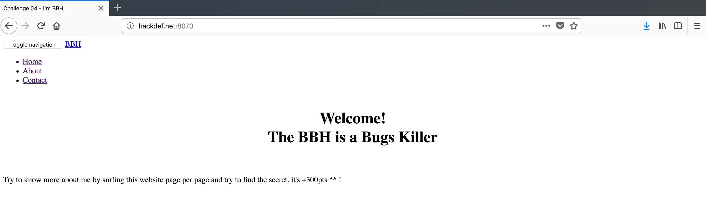
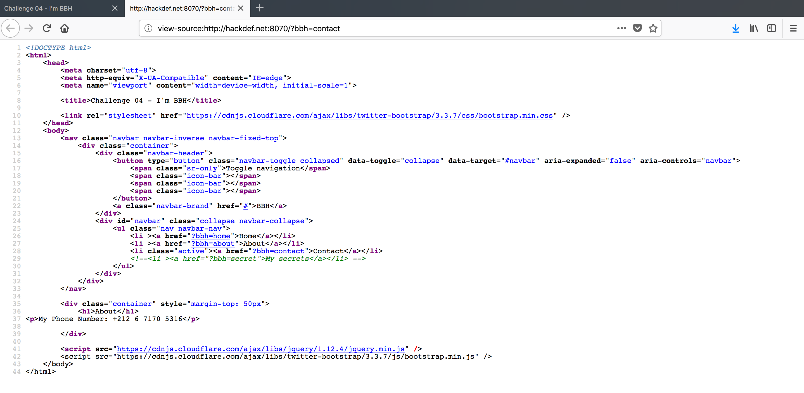
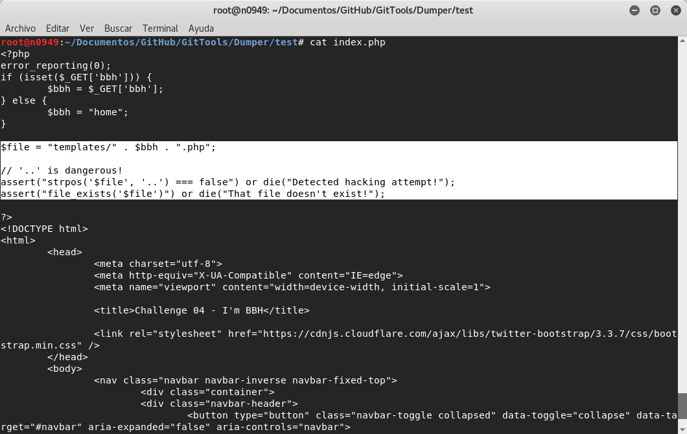
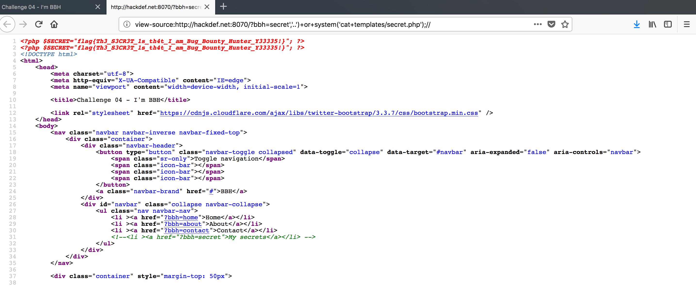

# HackDefCTF Quals-2018 - BBH (300 pts)

> **Descripción:** *The BBH is a Bugs Killer*

* http://www.hackdef.net:8070/

Al ingresar al sitio, se observan 3 links a `home`, `about` y `contact` los cuales muestran contenido diferente, pero nada de utilidad que nos lleve a la bandera..

  

Revisando el código fuente, observamos que hay un comentario de un `href` hacia `secret`, sin embargo si tratamos de ingresar modificando la url pero nos redirigia al home del sitio. 

  

Una vez inspeccionado el sitio manualmente , por medio de burp lanzamos un *spider* para ver si podía localizar `secret`, sin embargo nos encontramos con algo de bastante utilidad...`robots.txt`

  

Al ingresar a este archivo nos mostraba un recurso... `/hint.png`

  

La pista era una imagen que nos daba a entender que el desarrollador estaba utilizando `git`

  

Utilizando la herramienta **[GitTools](https://github.com/internetwache/GitTools)**, descargamos el repositorio locamente con el comando `gitdumper.sh http://hackdef.net:8070/.git/ test1` y comenzamos a buscar la bandera o alguna pista que nos llevara a ella. Encontramos el archivo `index.php`y observamos que en la línea `$file = "templates/" . $bbh . ".php";`, la variable `$bbh` se obtiene directamente por medio de `$bbh = $_GET['bbh'];` sin validación alguna, además de que, en teoría, si contatenamos algun comando como `system(ls -la)` se prodría ejecutar debido a que no hay ninguna protección que lo impida.

  

Después de algunos intentos exitosos de ejecutar comandos por medio de la función `system(command)`, llegamos a la conclusión que se trataba de una vulnerabilidad de ***Remote Code Execution***... pero, como obtener la bandera con lo que se sabía hasta el momento?, la respuesta estaba en los comentarios del código fuente `<!--<li><a href="?bbh=secret">My secrets</a></li>-->`, si tratabamos de ingresar directamente por medio de la URL a `http://www.hackdef.net:8070/?bbh=secret` nos redirigía al home, entonces el comando que teníamos que ejecutar debía tratar de acceder a `secret`, así que colocando en la url `?bbh=secret,'..')+or+system('cat+templates/secret.php');//` se obtuvo la bandera **`flag{Th3_S3CR3T_1s_th4t_I_am_Bug_Bounty_Hunter_Y33335!}`**

  

