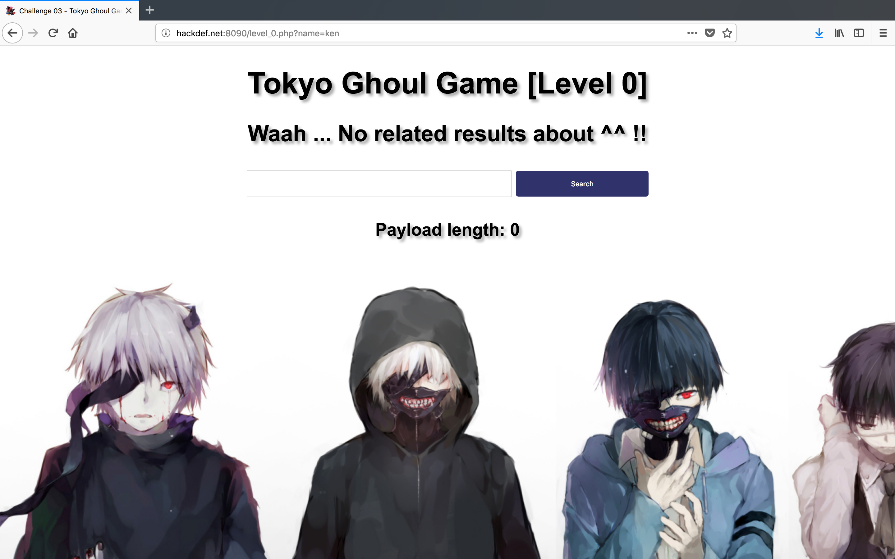
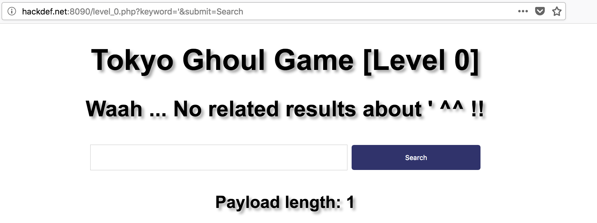
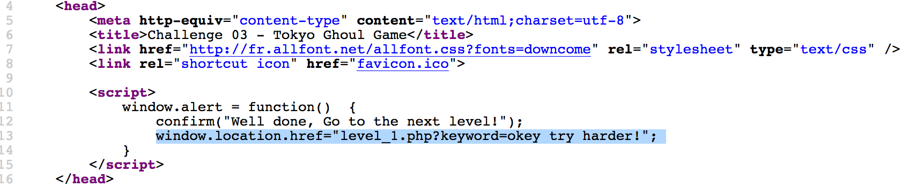
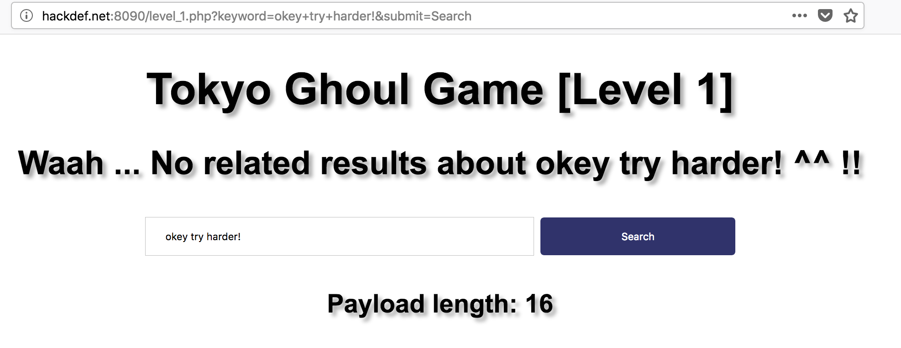
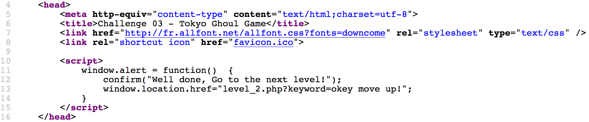
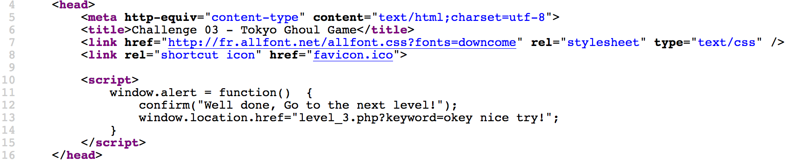
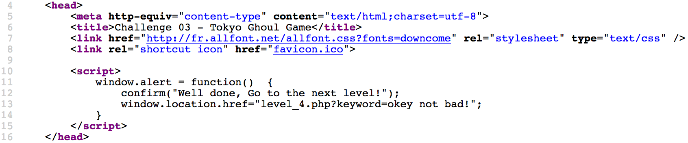
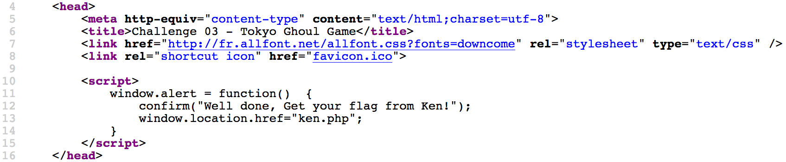
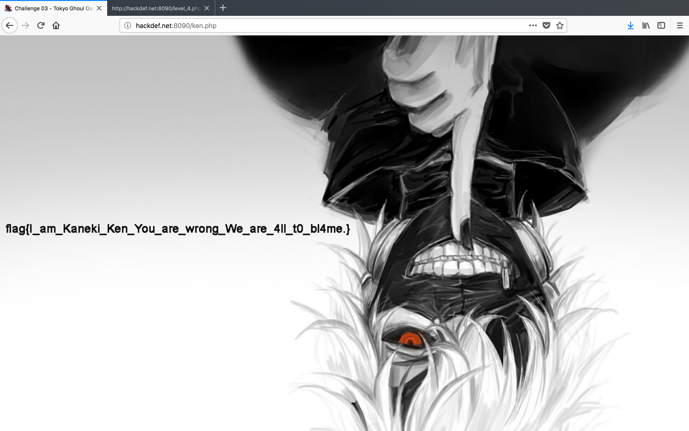

# HackDefCTF Quals-2018 - Ghoul (100 pts)

> **Descripción:** *Será que estos Z0mbies te detendran a encontrar la vulnerabilidad?*

* http://www.hackdef.net:8090/

Al ingresar al sitio, después de dar clic en el botón de inicio, se muestra una pantalla con un *textbox* y un botón *search*

  

Observamos que al ingresar cualquier *payload*, los parámetros se envían por `GET`, además de que se muestra en pantalla el tamaño de la cadena escrita...

  

Revisando el código nos encontramos con el script que se ejecuta una vez que se ha ingresado el *keyword* correcto del nivel 0.

  

Entonces, si ingresamos esa referencia en la *URL*, colocamos el *keyword* que se muestra en el código fuente y oprimimos *search*...

  

Al parecer no pasa nada, pero si revisamos el código fuente...bingo!!!, observamos el mismo *script* que nos da acceso al nivel 2. 

  

Realizando el mismo procedimiento obtenemos acceso al nivel 3

  

... al nivel 4

  

En el nivel 4, vemos que aparece la frase `Do you have an invitation?`, al parecer no es nada raro, si colocamos el *keyword* y leemos el código fuente vemos que se hace referencia a `ken.php` donde seguramente debe estar la bandera ya que se lee `Well done, Get your flag from Ken!`

  

Finalmente, si accedemos al recurso `ken.php` obtenemos la bandera: **`flag{I_am_Kaneki_Ken_You_are_wrong_We_are_4ll_t0_bl4me.}`**

  

