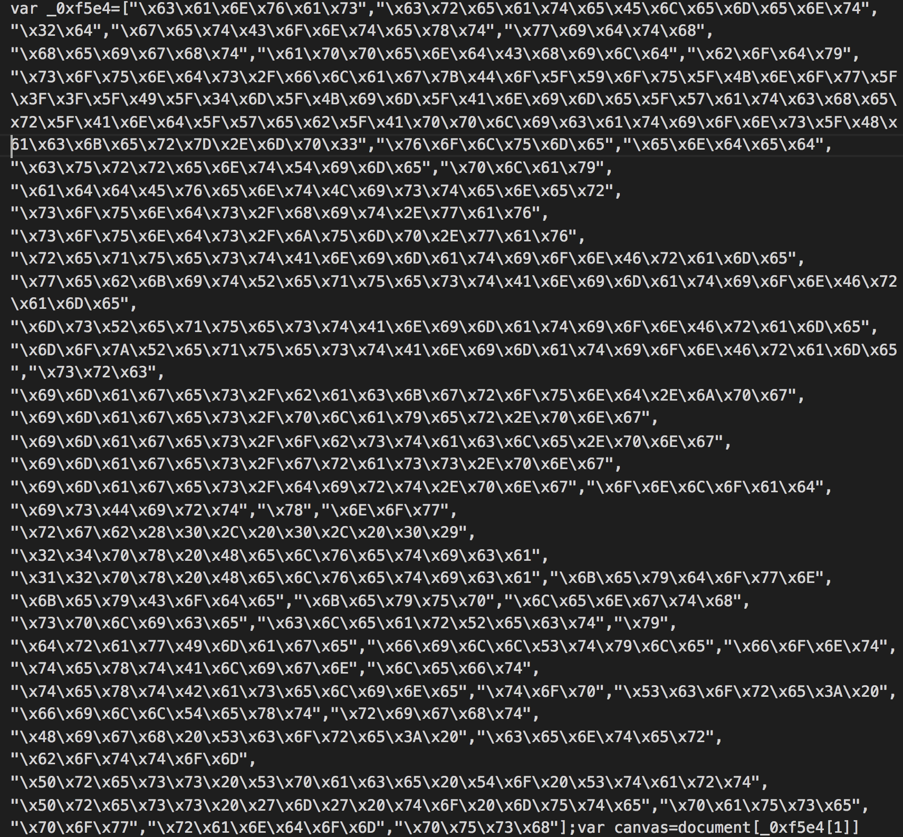
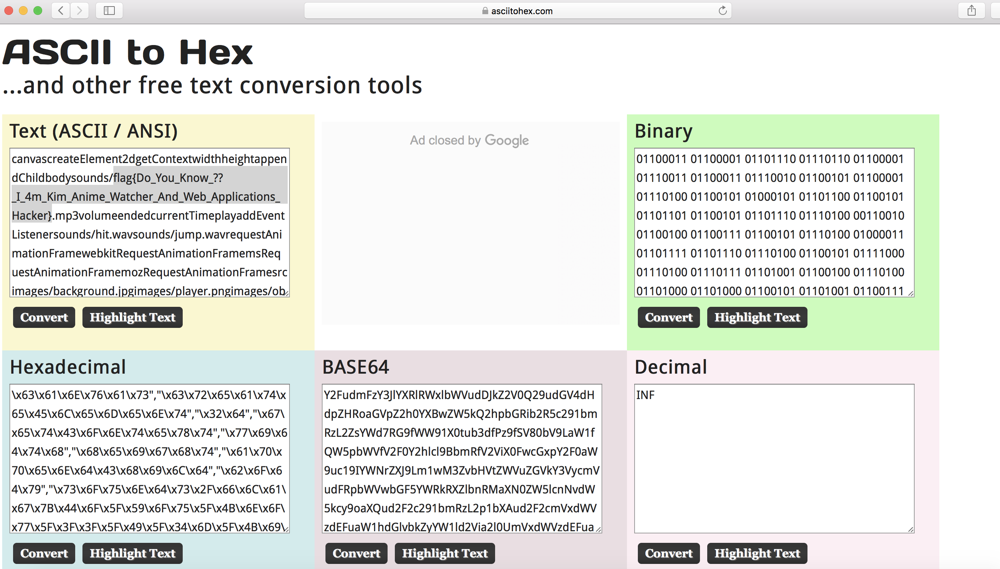

# HackDefCTF Quals-2018 - Kim_Web (100 pts)

> **Descripción:** *Algo sucio esta en este sitio, sera que puedes deofuscarlo?*

* [**Kim_Web.zip**](./Kim-Web.zip)

En los archivos que proporciona el reto, se encuentra el `index.html`. Revisando el código nos dimos cuenta de que una parte se encuentra en hexadecimal.

  

Si convertimos esta parte del código en ASCII obtenemos la bandera: **`flag{Do_You_Know_??_I_4m_Kim_Anime_Watcher_And_Web_Applications_Hacker}`**

  

