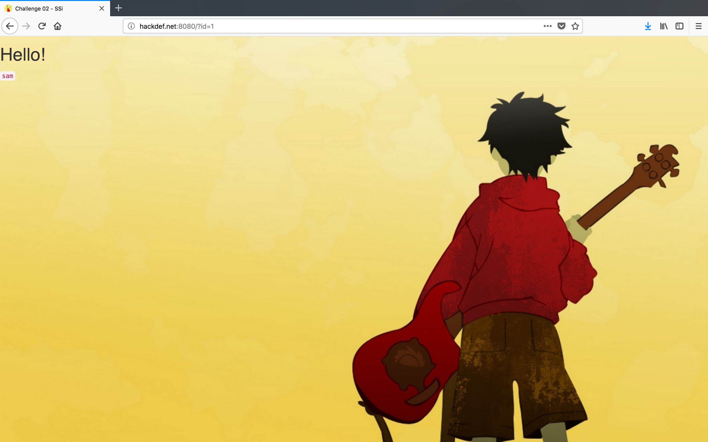

# HackDefCTF Quals-2018 - SSI (100 pts)

> **Descripción:** *Puedes encontrar la vulnerabilidad en este sitio web?, Lo puedes encontrar aqui:*

* http://www.hackdef.net:8080/

Al ingresar al sitio, se muestra la palabra `sam` cuyo `id=1`

  

En el codigo fuente, se observa el recurso `sam.jpg`. 

  

Si se accedía por medio de la URL `http://www.hackdef.net:8080/sam.jpg` se mostraba la imagen, entonces pensé que quizá se podía obtener la bandera con: `http://www.hackdef.net:8080/flag` y funcionó... **`flag{Simpl3_SQLi_f0r_G00d_Ppl}`** 

  

